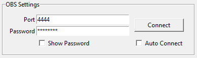
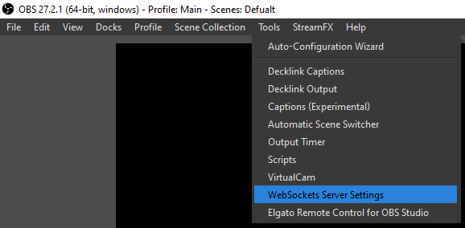
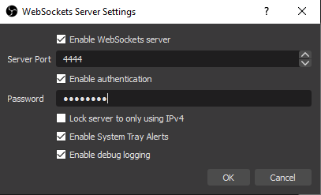
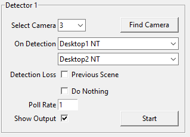

# Face Detection Scene Switcher

 Face Detection Scene Switcher for OBS.  
 Monitor up to 4 video inputs for face detection. When a face is detected in a video it will switch to the user specified scene, when it no longer detects a face it can take one of three actions: switch to a specific scene, go to the previous scene before detection or do nothing and stay on the detected scene.

## Download

[OBS Face Detect Switcher](https://github.com/ElectricCandlelight/OBS-Camera-Auto-Scene-Change/raw/master/FaceDetect.zip)

## Usage

### OBS Settings

The program requires OBS websockets enabled, a port number and a password if authentication has been enabled in OBS.

### Detector Settings

**Select Camera:** Clicking Find Camera will scan for all available video sources (This takes a few seconds) and cycle through a 5 second preview of each source, pressing any key will select the current camera, or you can use the dropdown box to select a camera.

**On Detection:** Lets you pick a scene to switch to when a face has been detected.

**Detection Loss:** has three options. Switch to a specific scene, go back to the previous scene before detection or do nothing and stay on the On Detection scene.

**Poll Rate:** is measured in FPS. A high poll rate will slightly increase the CPU usage but will be more responsive. In practice a poll rate of 1 is good enough.  

**Show Output:** Will show what the program is seeing and will draw a green square round any detected faces. This is not required when running, it is mainly just to check the correct camera is selected and working.

## Limitations

Cameras connected by USB can only be used by one program at a time. To use a webcam in multiple programs use something like SplitCam or install the [OBS Virtualcam 2.0.5 plugin](https://obsproject.com/forum/resources/obs-virtualcam.949/) and use the source filter (This has to be manually started each time OBS is opened)
